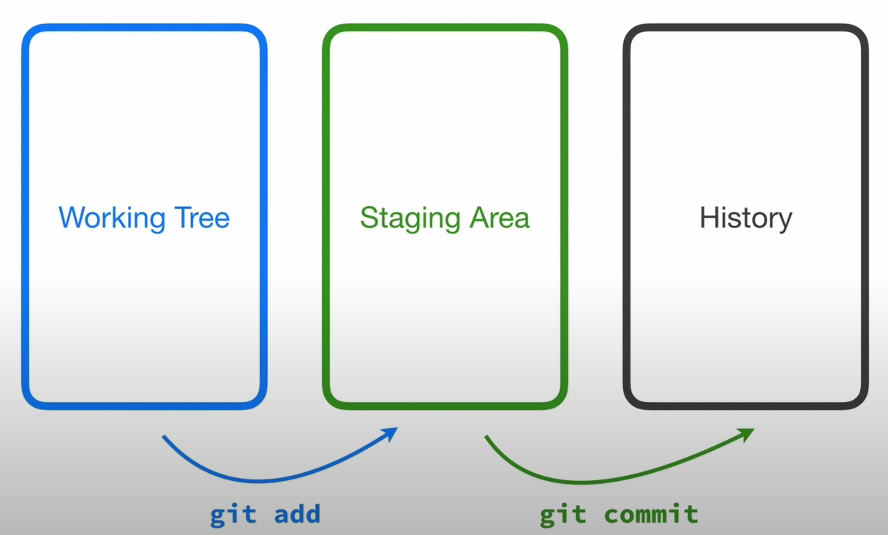

  

## Environment repo git
- <b>Working Directory:</b> working directory adalah tempat kita mengelola repo git
- <b>Staging Area:</b> sebuah environment yang menyimpan informasi tentang perubahan yang terjadi pada repository
- <b>History:</b> log hasil commit yang telah dilakukan