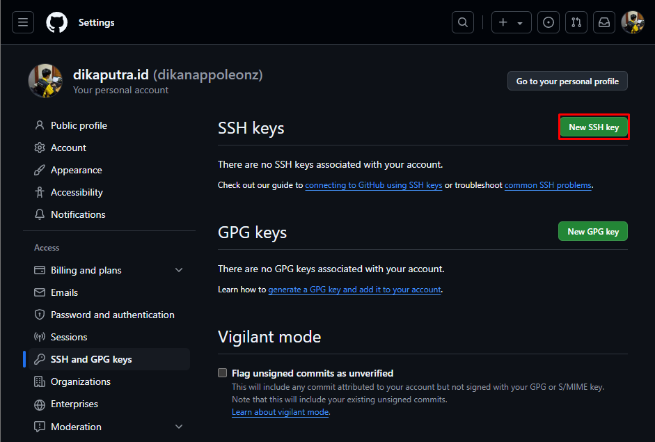
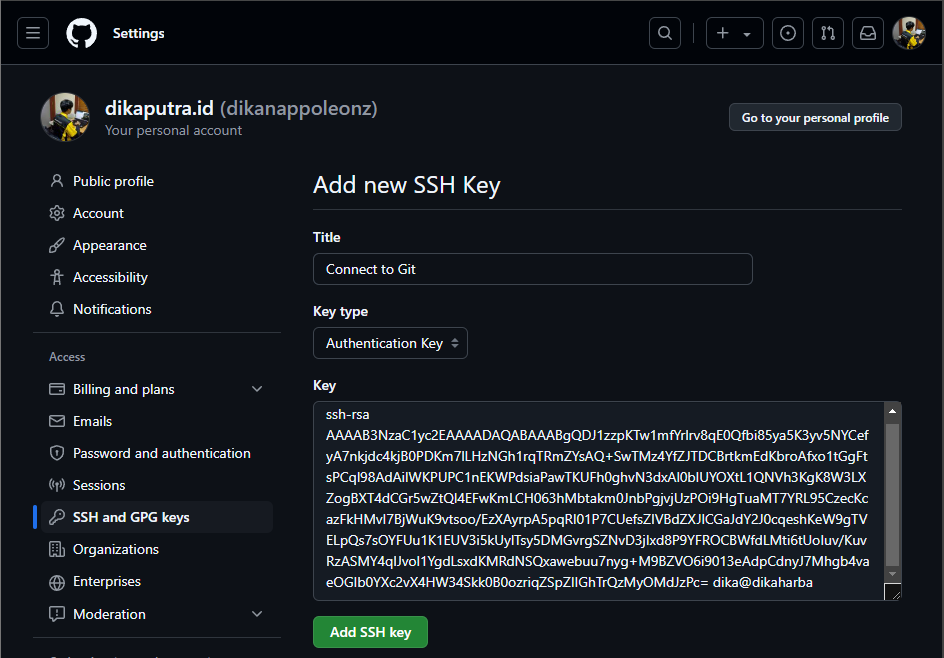
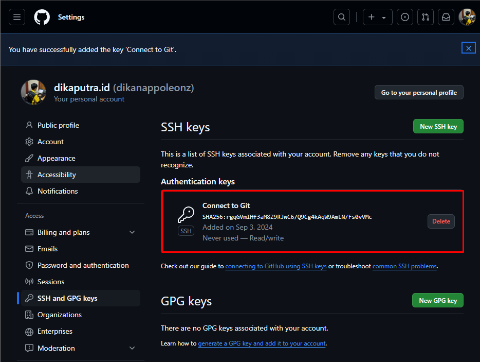

## Git Remote
- Create Keygen in wsl
```js
dika@dikaharba:/mnt/c/Users/LENOVO/OneDrive/Documents/Github/git/learn-git$ ssh-keygen
Generating public/private rsa key pair.
Enter file in which to save the key (/home/dika/.ssh/id_rsa): 
Enter passphrase (empty for no passphrase): 
Enter same passphrase again: 
Your identification has been saved in /home/dika/.ssh/id_rsa
Your public key has been saved in /home/dika/.ssh/id_rsa.pub
The key fingerprint is:
SHA256:rgqGVmIHf3aM8Z9RJwC6/Q9Cg4kAqW9AmLN/Fs0vVMc dika@dikaharba
The key's randomart image is:
+---[RSA 3072]----+
|oo     ..o       |
|*.    . . E      |
|o=   = . . o .   |
|+ + o &   . o    |
| * = X OS.       |
|..B = +.= o      |
|.ooo   o.=       |
|.. .   .. o      |
|    ...    .     |
+----[SHA256]-----+


dika@dikaharba:/mnt/c/Users/LENOVO/OneDrive/Documents/Github/git/learn-git$ cat /home/dika/.ssh/id_rsa.pub

//show key public
ssh-rsa AAAAB3NzaC1yc2EAAAADAQABAAABgQDJ1zzpKTw1mfYrlrv8qE0Qfbi85ya5K3yv5NYCefyA7nkjdc4kjB0PDKm7lLHzNGh1rqTRmZYsAQ+SwTMz4YfZJTDCBrtkmEdKbroAfxo1tGgFtsPCql98AdAiIWKPUPC1nEKWPdsiaPawTKUFh0ghvN3dxAl0bIUYOXtL1QNVh3KgK8W3LXZogBXT4dCGr5wZtQl4EFwKmLCH063hMbtakm0JnbPgjvjUzPOi9HgTuaMT7YRL95CzecKcazFkHMvI7BjWuK9vtsoo/EzXAyrpA5pqRI01P7CUefsZIVBdZXJlCGaJdY2J0cqeshKeW9gTVELpQs7sOYFUu1K1EUV3i5kUylTsy5DMGvrgSZNvD3jIxd8P9YFROCBWfdLMti6tUoIuv/KuvRzASMY4qlJvol1YgdLsxdKMRdNSQxawebuu7nyg+M9BZVO6i9013eAdpCdnyJ7Mhgb4vaeOGIb0YXc2vX4HW34Skk0B0ozriqZSpZIIGhTrQzMyOMdJzPc= dika@dikaharba
```

- Create New SSH keys Github
<p align="center">
  
</p>

- Paste .pub wsl 
<p align="center">
  
</p>
<p align="center">
  
</p>